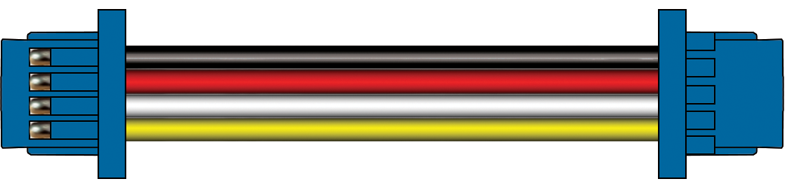
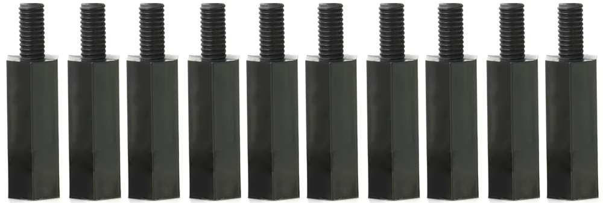
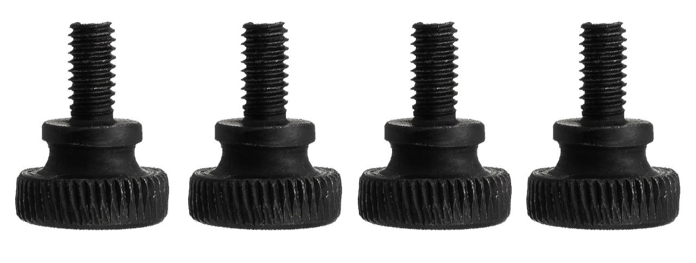
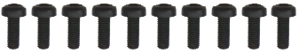
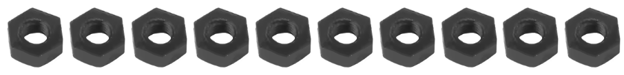

# Cables & Connectors
---

DUELink cables for connecting modules  

| 

---

10x standoffs Male-to-Female

| 

---

10x standoffs Female-to-Female

|

---

4x thumb screws 

|

---

10x screws 

|

10x nuts

|