# Console

---

The DUELink Console provides many functionalities. It is a great start to verify the device is functioning properly. It is also a great place to learn about and use [DUELink Scripts](/docs/engine/scripting.mdx).

[**console.duelink.com**](https://console.duelink.com/)

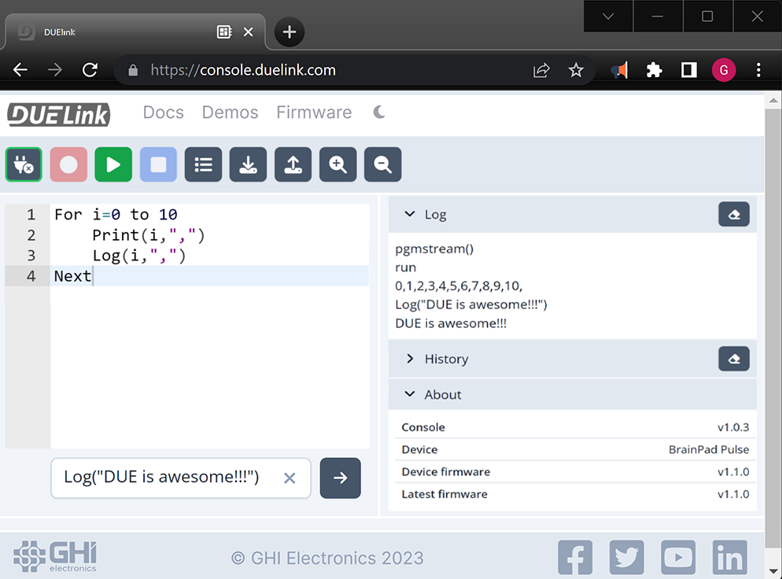 

---

## Immediate Window

The immediate text box sends and runs the code immediately on the DUELink hardware as soon as the `Enter` key or `arrow` button is pressed. 

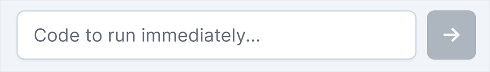 

Try `DWrite('L',1)` to run the LED on and then `DWrite('L',0)` to turn it off.

---

---
## Log & History Windows

The DUELink Log window is where DUELink hardware will talk back to the console. `Log()` functions appear directly in this window.  The History windows provides a history of your DUELink session. The `eraser` button clears the windows. 

```basic
Log("This is where log outputs appear")
```

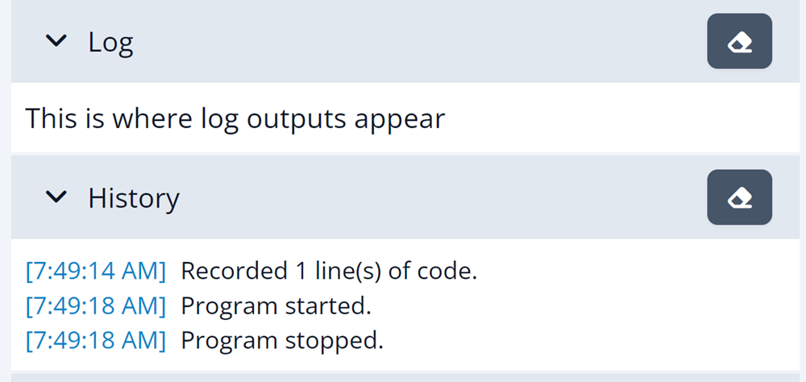 

---

## Connect

Select the connect button to connect to the DUELink hardware.

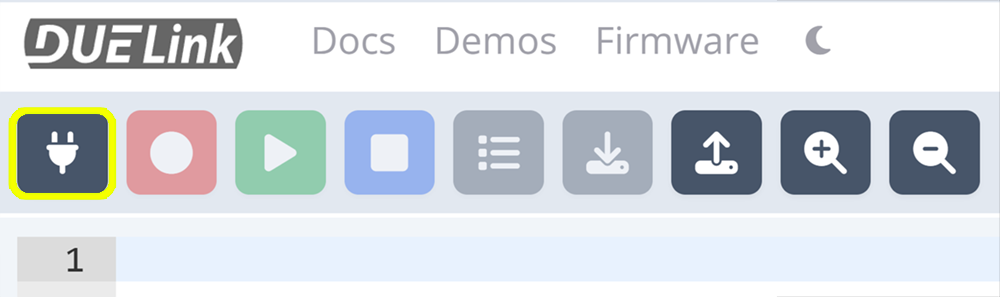 

---

## Record

Sends the script in the editor window to the DUELink hardware's flash. 

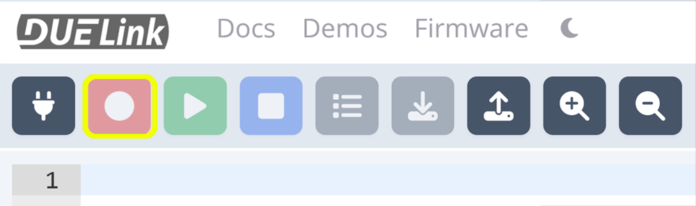 

---

## Play

Runs the code that is stored in flash. 

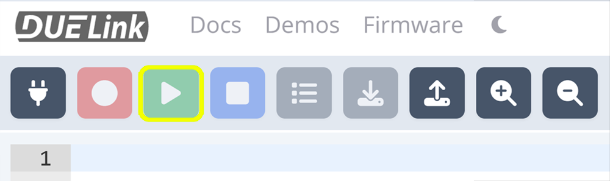 

---

## Stop

Stops the program running on the DUELink hardware.

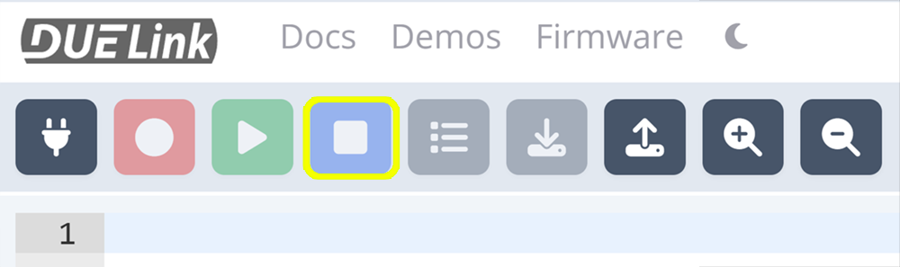 

---

## List

The List button loads the program currently stored in flash into the editor window. 

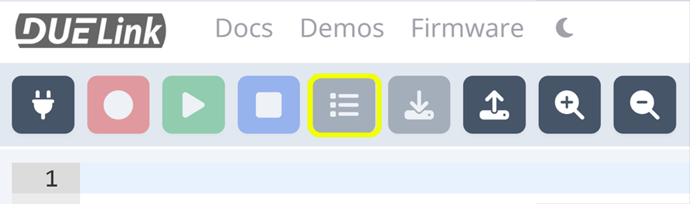 

---

## Download

Saves the code in the consoles editor window to a text file. 

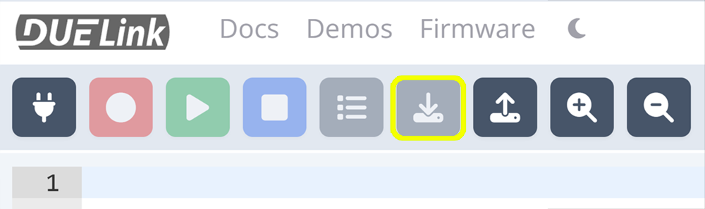 

---

## Load

Loads a saved program into the editor. 

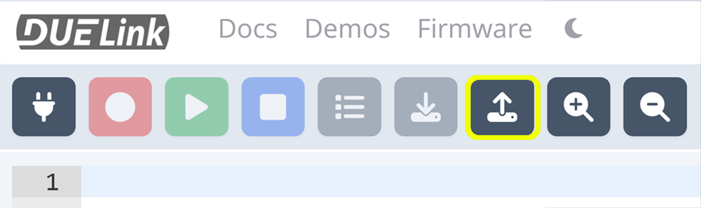 

---

## Zoom

Zooms the edit window in and out. 

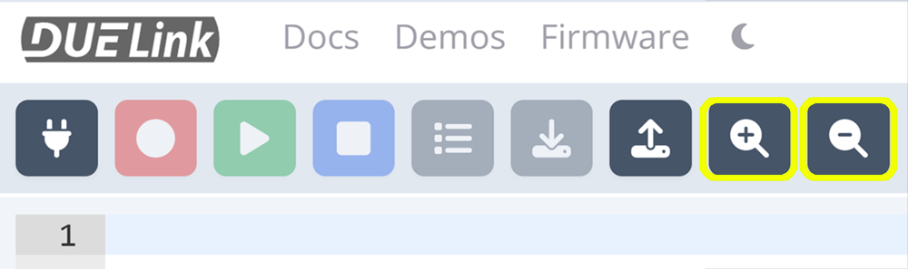 

---

## Docs

Links to the DUELink Script Documentation.

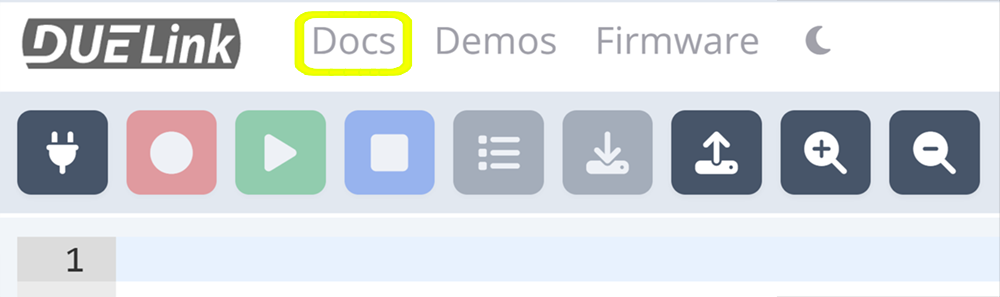 

---

## Demos

Select from pre-built DUELink Script Demos that load into the edit window.

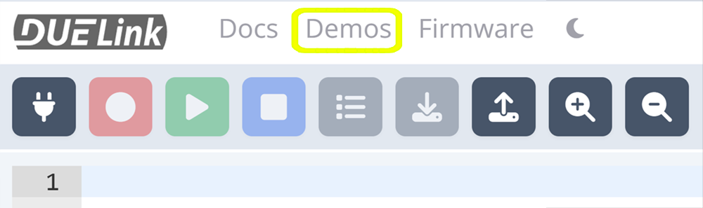 

---

## Firmware

Select and load the appropriate firmware to your device.

 

---


## Theme

Changes the consoles theme to Light or Dark. 

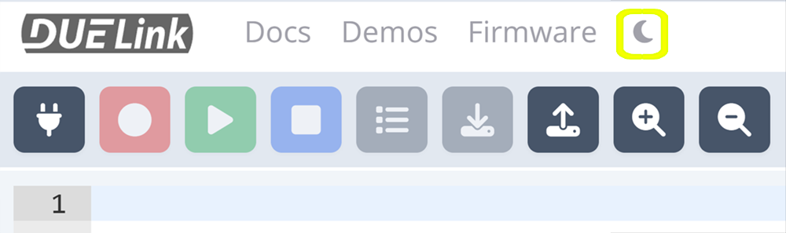 

---