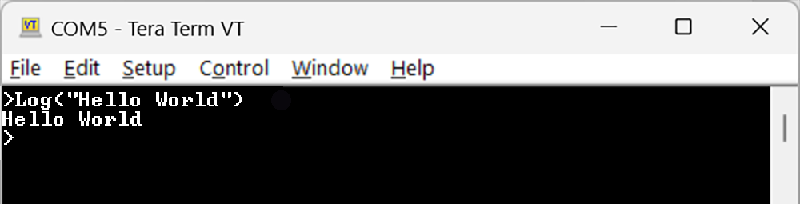
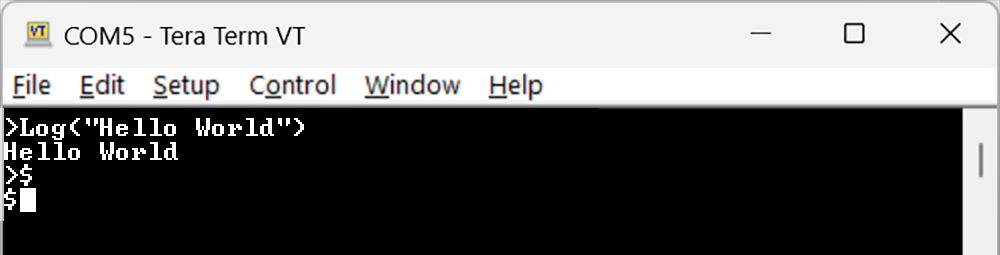

# Internal Engine
---

DUELink modules run an Internal Engine that is used to handle commands over multiple [Interfaces](../interface/intro), which include handling a stream of [DaisyLink](./daisylink) modules on the [Downstream](../interface/downstream) socket.

The engine is also used to extend the system capabilities and make it possible for the system to run [Standalone](./standalone).


The DUELink Engine has two modes `Immediate Mode` where commands are executed immediately, and `Record Mode` when commands are stored internally in the module.

:::note
DUELink [Console](../console) handles both commands without the users needing to understand any details. This section help in understanding the engine internals.
:::

## Immediate Mode

`Immediate Mode` is ideal for sending single line command to trigger actuator into action or read sensor data for example. A command can be `LED(200,200,50)` to blink the status LED 50 times with a 200ms on/off interval. It is possible to send multiple commands in a single `Immediate Mode` shot by adding `:` between commands. For example: `LED(200,200,50):Print("DUELink")`.

To test the interworking of the engine manually, instead of using [Console](../console), open a terminal software and connect it to the serial port presented by the connected DUELink module. We like [Teraterm](https://teratermproject.github.io/index-en.html). 

image

Hitting the key will result with `>` prompt. This is the `Immediate Mode` prompt. Entering `>` is also the command to switch to `Immediate Mode`. Keep a note of this once you switch to `Recording Mde` later.

:::note
Immediate Mode is the default mode when device is first connected.
:::

Type `Print("Hello World")` and hit enter. The engine will execute the `Print` command and show `Hello World`.




:::tip
The engine handles backspaces and left/right arrows to help in editing the entered commands. It even has entered-command-history that can be fetched using up and down arrow keys.
:::

Immediate Commands typically come from one of the [Supported Systems](../system/intro) over one the [Interfaces](../interface/intro).

## Record Mode

`Record Mode` takes the received commands and stores them internally. Those commands can be executed using `run` command. Use `list` to see a list of recorded commands, and `new` to erase everything and start new.

The `Record mode` is entered using the `$` command. This will also switch the prompt to `$`. All statements entered are stored internally and *not* executed. The `run` command can be used to execute the program. The device will also automatically `run` a program on power up.

:::note
The commands `run`, `list`, and `new` are never recorded! They are used to handle the recorded program.
:::

Go ahead and enter `$` and press the enter key.


Add three lines of `print` commands. Nothing will get executed as those commands are getting stored internally, not executed. When finished, use 'list' to see the commands.

image

Use `run` to run the program.

image

Add another command to the list then try to run again.


image

use `new` to erase the program. Verify the program is removed using `list`.

image

:::note
It is not possible to modify individual lines once recorded. This is not a problem when using the [Console](../console) as it sends the program complete in one shot.
:::

We can run a program that runs indefinitely using loops.

```
$ Print("Hello ")
$ Print(" world")
$ Print(" 123!!")
```

image

A running program can be terminated by hitting the ESC key, DEL Key, or Backspace Key. Hit escape, then 'new' to erase the program. verify using 'list'.

image

Recording programs are either used to run the module [Standalone](./standalone) or to extend the module's functionality. We call this `Hybrid Mode`.

## Hybrid Mode

There is no `Hybrid Mode` exactly, but you can combine both immediate and record modes to extend the system with additional commands. Say we want to extend the system with a `Hello()` function. We can record this extension that can be executed immediately.

Enter recoding mode then start a `new` program. Then Enter this program:

```
fn Hello(s)
Print("Hello ")
Println(s)
fend
```

Now, `list` the program to make sure it was recorded properly.

image

Switch to immediate mode and enter `Hello("John Due")`.

image

This is exactly how hundreds of modules provide user-friendly commands. They all have a recorded script that handles module-specific tasks. Then these extended commands can be executed from a [Supported System](../system/intro) over one of the [Interfaces](../interface/intro). 