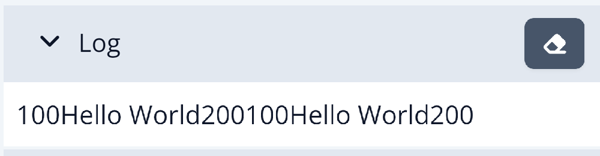

# Scripting Language
---

The DUELink Scripting Language that runs internally on any DUELink Hardware. The scripts are used to extend and tunnel in the commands from a [Hosted Language](../language/intro) [Python](../language/python.mdx) that is running on one of the [Supported Systems](../system/intro) such as [Raspberry Pi](../system/raspberry-pi). It can also be used to run the modules [Standalone](./standalone), independent from any host.

Scripts are not case sensitive, with a simple syntax that is inspired by BASIC and Python. The power of DUELink Scripts comes from its simplicity, rather than from its feature set. This is the perfect language to teach someone coding, to to extend DUELink modules with additional functionality.

:::tip
Even though the scripting engine is not case sensitive, we use `Print()` rather than `print()` or `prInT()` to keep things looking great!
:::

Beside running scripts [Standalone](./standalone), the system can run through a [Hosted Language](../language/intro) with one of the [Supported Systems](../system/intro). This gives any user very powerful options with great flexibility.

## Print

`Print()` is a function that prints (outputs) the passed arguments. These arguments can be variables, strings, or equations. `Print()` can handle multiple arguments.  

`PrintLn()` is exactly the same except it adds line break at the end.

```py
x=100
PrintLn(x)
PrintLn("Hello World")
PrintLn(x+x)
PrintLn(x,"Hello World", x+x)
```



## Comments

The `#` character is used to identify a comment. Comments are ignored by the program, text added to help developers understand the code.

```py
# This is a comment
x=10
Print(x) # This is also a comment 
```
## Whitespace
Space doesn't mean anything to the DUELink Scripting Language. However, new lines (or `:`)are important to start new commands.

```py
Print   ( "DUELink"   )
```

Is exactly the same as

```py
Print("DUELink")
```

## Variables

DUELink Script has a fixed set of 26 global float-type variables, one for each letter, assigned to `_a` to `_z`. To use a global variable, simply use `_x=5.5`.

There are also local variables used in functions, still float-type. More on these under functions.

## Arrays

There are 10 float-type arrays and 10 byte-type arrays. The float arrays are named a0 to a9 and the byte arrays are names b0 to b9. All arrays are size zero by default. Use `Dim` to allocate memory for an array, like `Dim a1[10]`.

Similar to other common languages, elements of an array are accessed using `[]`. 

This is an example that uses both, global variables and arrays:

```py
Dim a1[10]

For _i=0 to 9
  a1[_i]=_i*2
Next

For _i=0 to 9
  PrintLn(a1[_i])
Next
```

The output will look like:

```
0
2
4
6
8
10
12
14
16
18
```

:::tip
Use `Dim a1[0]` to free up the memory reserved for array `a1[]`.
:::

Arrays can be initialized in two different ways.

Declare an array and initialize it with values at the same time.  

```py
Dim a1[6] = [1,2,
            3,4,
            5,6]
For i in Range(Len(a1))
  PrintLn(a1[i])
Next
```


:::note
`Len(a1)` returns the length (size) of the a1 array.
:::

The second way is to create the array first, then populate it later. 

```py
Dim a1[6]

a1 = [7,8,
     9,10,
     11,12]
For i in Range(Len(a1))
  PrintLn(a1[i])
Next
```

There are some specific things we must know about initializing arrays:

1. Multi-line initializers must have a comma ending the line if the following line will have more data for the initializer (see the examples above).
2. Multi-line initializers can only be used in "record" mode. In immediate mode, the initializer must be on a single line.
3. Initializers are always run, so if the initializer is inside a loop every time the dim or assignment initializer is encountered it will reinitialize the data in the array
4. You can have fewer values in the initializer than what the array holds, but you cannot have more. You will get an error indicating that a `]` was expected if there are too many elements in the initializer
5. Since we do not want to do too many dynamic allocations, the size of the array must be specified when using dim even when initializing the array 

:::tip
`Dim` will automatically set the appropriate size when it sees an initializer, like `Dim a1[] = [1,2,3,4,5]' will create an arrays with 5 elements.
:::

It is also possible to initialize an array with a string of text. The line `b1="GHI"` will set b1[0] to ASCII `G` and so on. The system automatically know if bytes or floats are needed and create the array properly.

Functions that accept arrays can take initializers as well.

```py
Dim a1[5] = [1,2,3,4,5]
SortArray(a1)

SortArray([1,2,3,4,5])
```
Byte arrays work exactly the same 

## Functions

functions start with `fn` and end with `fend`. Arguments must be included in the function definition.

```py
fn Add(a,b)
return a+b
fend
```

Then the function can be executed using `Add()`. This can be done from withing the script or from an external source over one of the [Interfaces](../interface/intro).

Here it is used by the same script.

```py
_x = Add(5,33)
Print(_x)
```

Variables inside functions are local. You can use any of the 26 letters as a variable name. The argument will automatically set the local variable with the matching name to the passed value. In the previous example, `a` and `b` local variables were automatically assigned with first and second argument values.

Function arguments can also be arrays. These arrays are passed as by reference.

```py
fn PrintArray(a1, c)
For i in Range(c)
  PrintLn(a1[i])
next
fend

Dim a3[] = [1,2,3,4,5]
PrintArray(a3) # the system will automatically reference a1 used in teh function to a3 that got passed.
```

Array initializer can also be used to call the function above.

```py
PrintArray([1,2,3,4,5], 3) # print 3 elements
```

And even use a string!

```py
PrintArray("DUELink", 7)
```

## Operands
DUELink Scripting supports the following operators. 

**Mathematical** | 
---         | ---                       |   
\+          | Add                       |   
\-          | Subtract                  | 
\*          | Multiply                  | 
\/          | Divide                    |
%           | Modulus, the remainder    | 
**Comparators** | 
\>          | Greater Than              
\<          | Less Than                  
\>=         | Greater Than or Equal To   
\<=         | Less Than or Equal To      
\=          | Equal                      
!=          | Not Equal                  
**Logical** | 
\&&         | And 
\|\|        | Or
**Bitwise** |                         
\&          | Bitwise And               
\|          | Bitwise Or 
^           | Bitwise Xor                
\<<         | Shift Right       
\>>         | Shift Left        

## while-loop
This is the kind of loop that stays active as long as a condition is true. a `while` loop block ends with `wend`.

```py
_x=10
while _x>5
Println(_x)
_x=_x-1
wend
```

## For-Loop
The For-Loop has two different syntax styles. **BASIC** and **Python** style. 

**BASIC Style**

The BASIC style For-Loop includes the last number in the range. 

```py
# Counting Up
For _i=1 to 5
Print(_i,",")
Next
```

Output:

`1,2,3,4,5,`

```py
# Counting Up in increments of 10
For _i=1 to 1000 Step 10
PrintLn(_i)
Next

# Counting Down in increments of 10
For _i=1000 to 1 Step -10
PrintLn(_i)
Next
```

**Python Style**

The for-loop also allows a format similar to Python. 

```py
# Range with only stop value
For _i in range(5)
Print(_i,",")
next
```
Output:

`0,1,2,3,4,`


```py
# Range with start and stop value
For _i in range(1,5)
Print(_i,",")
next

# Range with start, stop, and step value
For _i in range(1,5,2)
Print(_i,",")
next

# Range with start, stop, and negative step value
For _i in range(10,1,-2)
Print(_i,",")
next
```

## If-Statement
If-Statements must end with the `End` command.

```py
If _x=1
PrintLn("one")
Else 
PrintLn("not one")
End
```

If-Statements can also be nested within each other. Each If-Statement requires an `End` command to terminate its own process. 

```py
If _x=1
  PrintLn("one")
Else
  If _x =2
    PrintLn("two")
  Else
  PrintLn("not one or two")
  End
End
```

## Labels

Labels are needed to redirect the program. They are used by `Goto`.

A Label is created by using the `@` symbol in front of the desired label. Labels are limited to 8 characters. 

## Goto

`Goto` is useful for repeating tasks indefinitely by sending execution to a specific *Label* name. 

```
@Loop
# add code here that runs forever
Goto Loop 
```

# Exit

`Exit` terminates the program.

```
Print("Hello")
Exit
Print("This will not get printed")
```

`Return` send the execution back from a called subroutine, see Subroutines below.

## Multi-Commands Lines
Multiple commands can be combined on a single line. This is especially useful when using `Immediate mode` where a single line is required. To use multiple command, a `:` symbol is used.

This is an example of a for loop in a single line

```basic 
For _i=1 to 1000 Step 10:PrintLn(_i):Next
```
