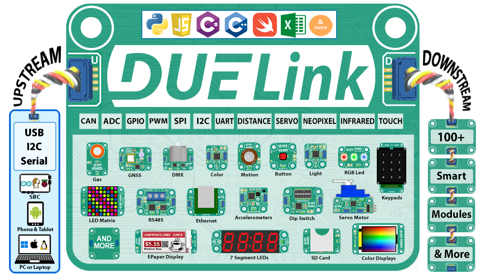

# Introduction

---

Get started now to access the physical world with only a few lines of code using the core library that has a user friendly [API](api/intro.mdx). Multiple [coding options](language/intro.mdx) are available , such as Python and JavaScript.

Advanced users can also extend the system through the internal [Engine](engine/intro.mdx) that runs [DUELink Scripts](engine/scripting.mdx).

