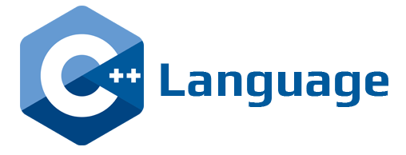

# C++

---



There are two ways to use C++ with DUELink, hosted and Standalone.

### Hosted

With a hosted option, a [PC & Laptop](../system/pc-laptop) or [Phone & Tablets](../system/phone-tablet.mdx) can be used to run the C++ program to command DUELink modules through [USB](../interface/usb) or [UART Serial](../interface/uart) interfaces.

This is an example

```
//code

```

## Standalone

With this option, a DUELink module is executing a compiled C++ program developed by you. All modules utilize STM32C071 microcontroller, which si supported by many IDEs, including free [STM32CubeIDE](https://www.st.com/en/development-tools/stm32cubeide.html). We however use ARM Keil MDK. This is a paid professional IDE but ST has already licensed it to make it [available for free for any STM32 Cortex-M0 micro]( https://developer.arm.com/documentation/kan344/latest/?lang=en). 

:::tip
These options use low-end versatile libraries. They are powerful but not user friendly! [Arduino](../system/arduino) is user-friendly alternative.
:::


```cpp
// example

```

To load your compiled program onto a DUELink module, you need to completely wipe it out, as documented on the [Loader](../loader) page. You can then use [STM32CubeProgrammer]( https://www.st.com/en/development-tools/stm32cubeprog.html) to load the compiled program.

:::tip
99.9% of modules include SWD pins if you want to connect and a debugger, such as ST-Link. SWCLK is found on the through hole "boot pads" or LDR button, as it shares BOO0 pin. SWDIO is found on a tiny SMT pad.
:::