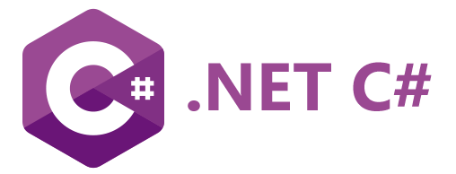

# .NET

---



The .NET DUELink library allows full .NET programs to access physical sensors and actuators. This allows complex .NET programs to do all the heavy lifting and send only the necessary components to control devices.

The provided library is implemented in C# but the user can use any .NET system, such as Visual Basic.

## Setup
This page assumes the user is already familiar with .NET C# and there is a development machine that is already setup to build and run .NET programs.

:::tip
Make sure your hardware is updated with the latest firmware listed on the [downloads](../downloads.mdx) page.
:::

Start a new project with a simple line of code to test out the project is running

:::tip
C# Top level statements feature is being utilized, but not required.
:::

```cs
Console.WriteLine("Hello, World!");
```
Download and install the latest `GHIElectronics.DUELink` library from NuGet.org. Alternatively, get it from the [downloads](../downloads.mdx) page.

## Blinky!

Our first program will blink the on-board on for 200ms then it shuts off for 800ms, and does this 20 times.

```cs
using GHIElectronics.DUELink;
Console.WriteLine("Hello DUE!");
var availablePort = DUELinkController.GetConnectionPort();
var duelink = new DUELinkController(availablePort);

// Flash the LED  (on for 200ms, off for 800ms, 20 times)
duelink.Led.Set(200, 800, 20);
Console.WriteLine("Bye DUE!");
```

You can now use any of the available [APIs](../api/intro.mdx) such as `duelink.Sound.Beep('p', 500, 1000)' to generate a sound on a connected buzzer.
