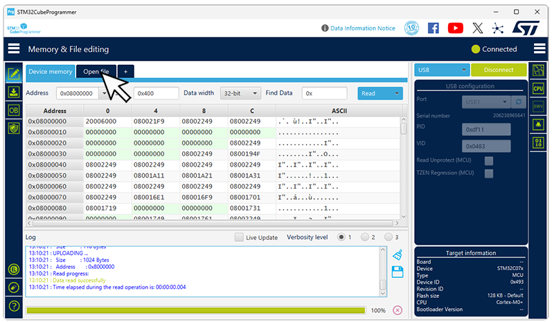
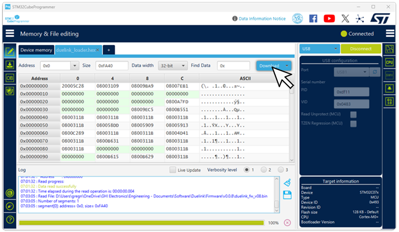

# Loader

---

The utilized micro on DUELink modules include a built-in loader from ST. It allows for firmware update using USB DFU class. ST provides [STM32CubeProgrammer]( https://www.st.com/en/development-tools/stm32cubeprog.html) to aid in loading programs, among many other things. This is a nice professional choice but it is not easy and we didn’t want to leave you with just that! 

All modules ship with GHI Electronics' DUELink Loader. This loader allows for firmware updates over USB, I2C, and UART. It uses XMODEM 1K protocol to send firmware updates, which is a common old standard found in any terminal software, such as [Tera Term]( https://teratermproject.github.io/index-en.html). To make things even easier, we have it supported right from within the DUELink [Console](console)

   

DUELink Console knows how to command the firmware to enter DUELink Loader mode. It sends `Reset(1)` command automatically. In case the firmware failed to run, you can force the loader mode by setting LDR pin high. If the module you are using has a LDR button, such as [DueDuino](catalog/mainboard/dueduino) then press and hold the button while resetting the board. 
Some boards label the button as "A", such as on [CincoBit](catalog/mainboard/cincobit).

  

If no button is found, LDR pads are on every single module. Bend and place a metal paper clip (or a wire) between these 2 pads, and reset/repower the board. You can remove the paper clip after the board is powered up.

  

---

## Loader Commands
* V: Loader Version Number: Firmware Version : Device Type (how do we fetch the firmware version from loader?)
* R: Run the firmware if found, regardless of LDR pin state.
* E: Erase firmware
* X: Start XMODEM 1K loading process
* Z: Completely wipeout the chip. This even wipes out the loader itself and changes the LDR pin back to BOOT0 for ST Loader.

## System Wipeout!
When desired, it is possible to completely wipe out the chip. This is useful when using different software, such as [Arduino](./system/arduino). This can be done from the loader or from the firmware.

### Using Firmware
Use `Reset(3)` command. That is it! See [Standard Library](./engine/stdlib).

### Using loader
 Enter the loader mode using LDR pads or LDR button. Enter the Z command and confirm (Press Y). This will completely remove everything, including the loader and will reset the LDR pin back to BOOT0. 

---

## Reloading Loader & Firmware
In case the loader was removed; to run [Arduino](system/arduino) programs for example, you can flash the DUELink loader back onto the device using [STM32CubeProgrammer]( https://www.st.com/en/development-tools/stm32cubeprog.html) tool. The Loader HEX file is found on the [Downloads](downloads) page. Connect the module to USB, directly if it has USB or using [USB Hook](catalog/accessory/usb-hook), push LDR, "A" button or place a paperclip in the loader pads and reset/repower.

  

STM32CubeProgrammer will now detect a USB DFU device, select `USB` from the drop down and click `Connect`.

  

Click on file and select the Loader file you downloaded from the [Download](downloads) page. 

 

Finally click the `Download` button to load the firmware on the device. 

  

The board now has the GHI Electronics DUELink Loader, ready to accept the firmware. 
