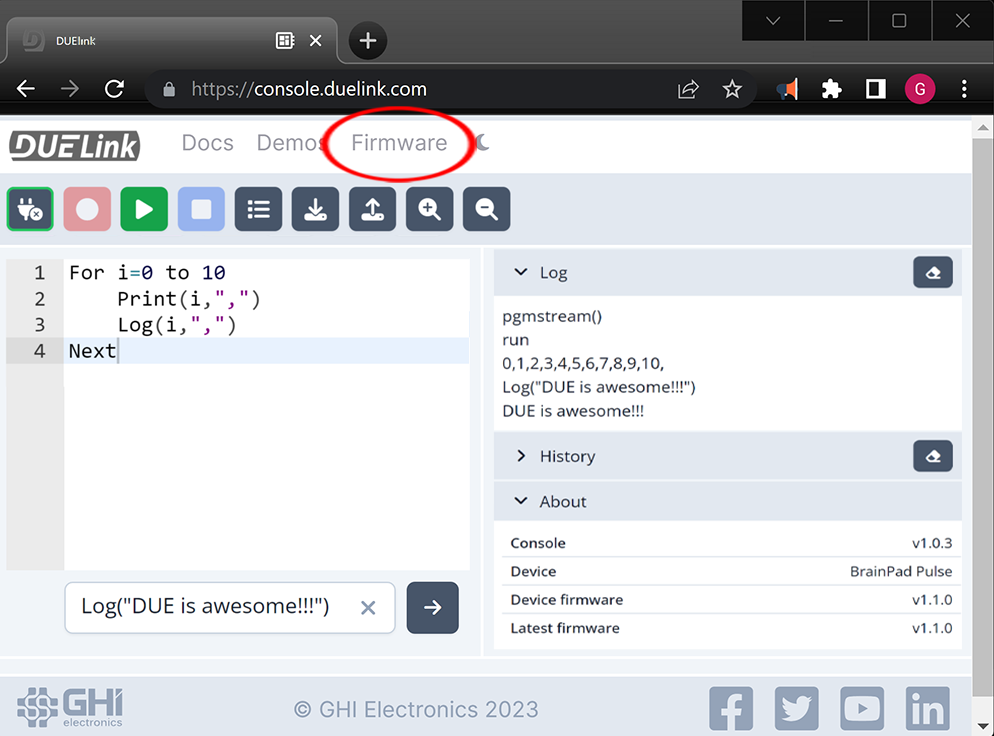
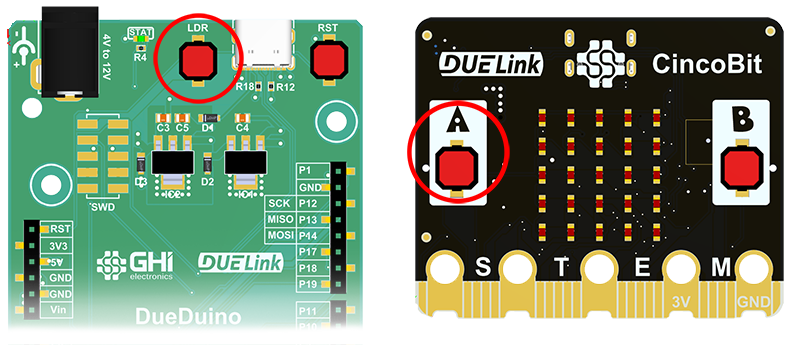
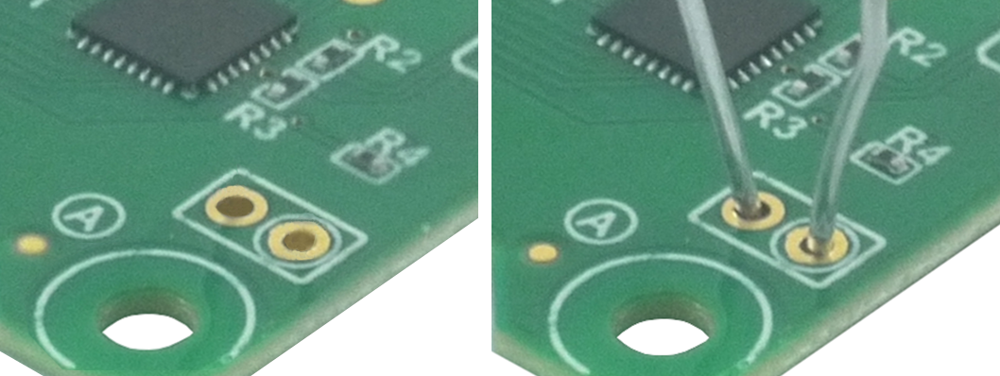
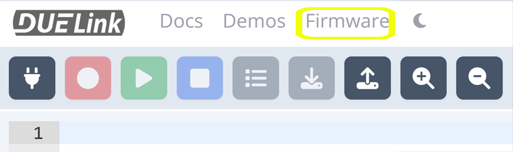
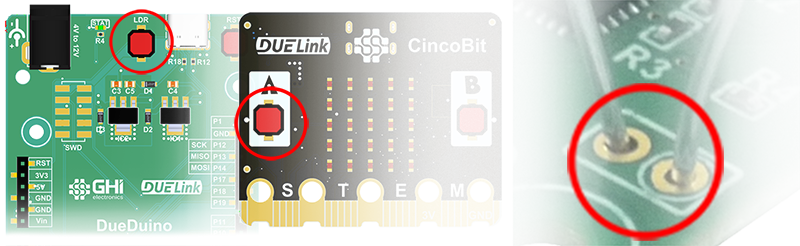
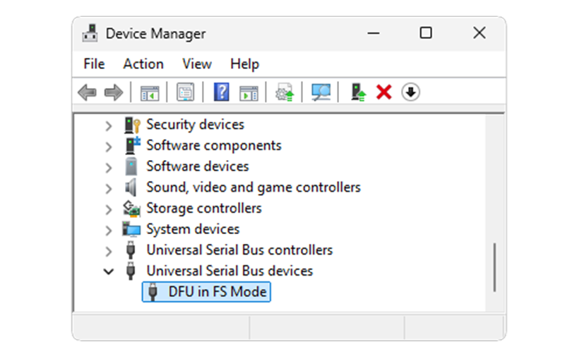
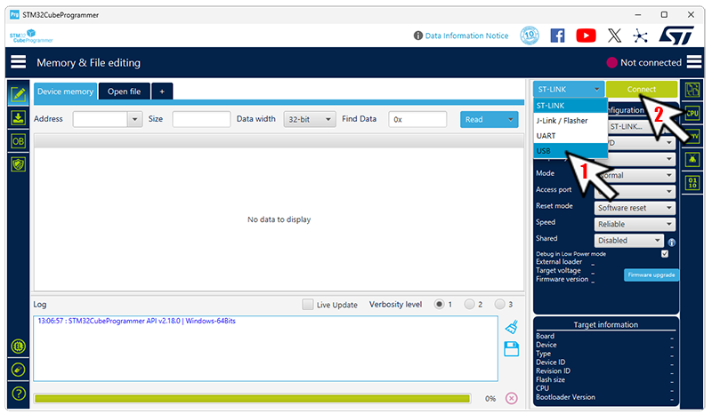
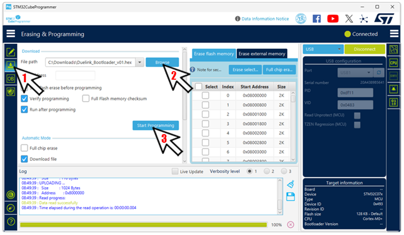

# Loader

---

The utilized micro on DUELink modules include a built-in loader from ST. It allows for firmware update using USB DFU class. ST provides [STM32CubeProgrammer]( https://www.st.com/en/development-tools/stm32cubeprog.html) to aid in loading programs, among many other things. This is a nice professional choice but it is not easy and we didn’t want to leave you with just that! 

All modules ship with GHI Electronics' DUELink Loader. This loader allows for firmware updates over USB, I2C, and UART. It uses XMODEM 1K protocol to send firmware updates, which is a common old standard found in any terminal software, such as [Tera Term]( https://teratermproject.github.io/index-en.html). To make things even easier, we have it supported right from within the DUELink [Console](console)

   

In case the firmware failed to run, you can force the loader mode by setting LDR pin high. If the module you are using has a LDR button, such as [DueDuino](catalog/mainboard/dueduino) then press and hold the button while resetting the board. 
Some boards label the button as "A", such as on [CincoBit](catalog/mainboard/cincobit).

  

If no button is found, LDR pads are on every single module. Bend and place a metal paper clip (or a wire) between these 2 pads, and reset/repower the board. You can remove the paper clip after the board is powered up.

  

---

## Loader Commands
* V: Loader Version Number: Firmware Version : Device Type (how do we fetch the firmware version from loader?)
* R: Run the firmware if found, regardless of LDR pin state.
* E: Erase firmware
* X: Start XMODEM 1K loading process
* Z: Completely wipeout the chip. This even wipes out the loader itself and changes the LDR pin back to BOOT0 for ST Loader.

:::tip
These commands are accessible from a terminal software for manual use. Provided tools such as the [Console](console) will automatically trigger needed commands, such as X to load the firmware.
:::

---
## Firmware Update

On power up, a DUELink module will start its Loader software. This loader checks the LDR pin. If the pin is in ST's BOOT0 mode, it changes it to LDR. If LDR pin is high, it will hold and wait for commands (LDR has a built in pull down resistor). If it is low, it will check for a valid firmware (the operating system) to execute it.

Firmware updates are necessary to bring the latest features and improvements to your modules. You will rarely ever need to update/remove the Loader but you will need to know how to update the firmware.

Firmware update is done in multiple ways:

**Using Console**
Click `Firmware` on the top menu.

  

Follow the instructions to update the firmware.

**Using Terminal**

Put the board in loader mode by pressing the LDR/A button, or shorting the LDR pads if there is no button.

  

Reset the board while holding LDR high, and the PC will see a Loader device.

  

Open a terminal software, such as [Tera Term]( https://teratermproject.github.io/index-en.html) and connect the appropriate COM port.

Hit `X` and `Y` to start XMODEM. You will see `CCCCC...` coming back.

image

From the menu, select `File->Send->XMODEM`. IMPORTANT: Select the 1K option and then select the firmware file you want to load. You can get any firmware you need from the [Downloads](downloads) page.

image

When complete, remove any jumpers wires on LDR, if any, and reset the board. Reconnect the terminal, but to the new COM port reflecting  firmware, then enter  `version()` command to see what version is loaded.

**Using Libraries**

The [API](./api/intro) libraries will include ways to update the firmware right from within the [Supported System](./system/intro), using a [Hosted Language](./language/intro) such as [Python](./language/python).

This is a future planner feature!

---

## System Wipeout!
When desired, it is possible to completely wipe out the chip. This is useful when using different software, such as [Arduino](./system/arduino). 

This can be done from the loader or from the firmware:

**Using Firmware**

Use `Reset(3)` command. That is it! See [Standard Library](./engine/stdlib). You can send this command from [Console](console) in the immediate window. Then send `Y` to confirm. Or, you can use a terminal software, such as [Tera Term]( https://teratermproject.github.io/index-en.html) to enter `Reset(3)` and then `Y` to confirm.

**Using loader**
 Enter the loader mode using LDR pads/button (button might be labeled `A`). Enter the Z command and confirm (Press Y). 

Either of the two options above,  will completely remove everything, including the loader, and will change the LDR pin back to ST's BOOT0. 

---

## Reloading Loader & Firmware
In case the loader was removed; to run an [Arduino](system/arduino) program for example, you can flash the DUELink loader back onto the device using [STM32CubeProgrammer]( https://www.st.com/en/development-tools/stm32cubeprog.html) tool. The Loader HEX file is found on the [Downloads](downloads) page. Connect the module to USB, directly if it has USB or using [USB Hook](catalog/accessory/usb-hook), push LDR, "A" button or place a paperclip in the loader pads and reset/repower.

  

STM32CubeProgrammer will now detect a USB DFU device, select `USB` from the drop down and click `Connect`.

  

Click on the side tab then select the `Loader` file you downloaded from the [Download](downloads) page, then click `Start Programming`

 

The board now has the GHI Electronics DUELink Loader, ready to accept the firmware. See "Firmware Update" above if you do nto know how.
