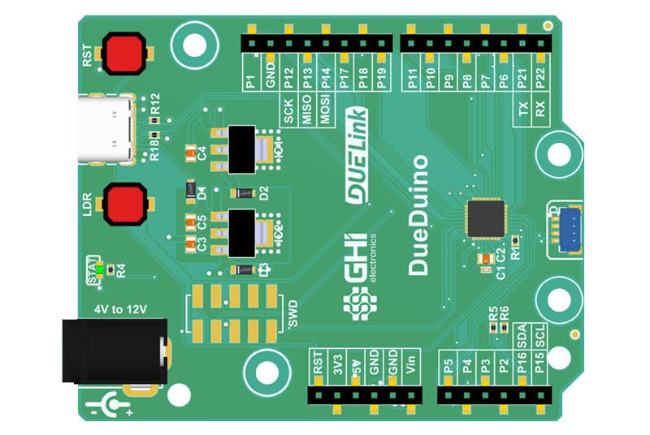
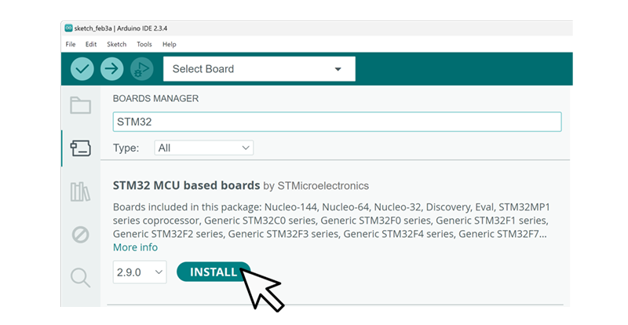
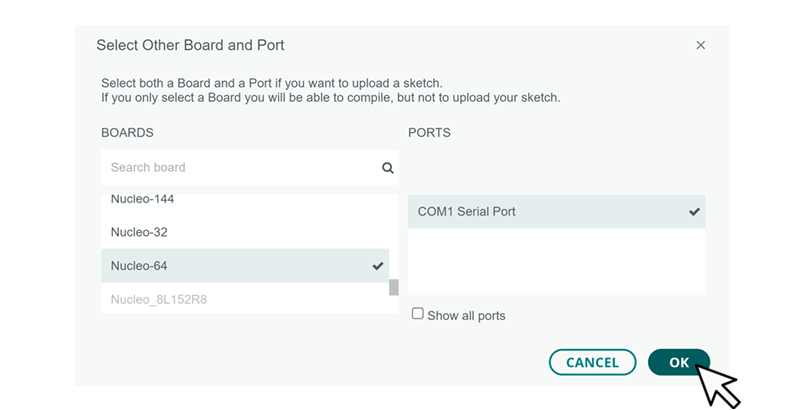
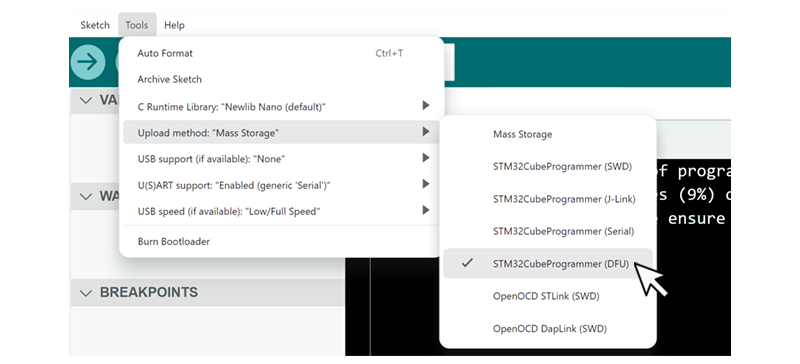

# Arduino

---

 


This is an interesting option because it allows a DUELink to be used in 2 very different ways. You can program any of the modules using the Arduino IDE/software. Or, you can use an Arduino board to control a stream of [Daisylinked](../engine/daisylink) DUELink modules. We will cover them individually.


## Programming Modules with Arduino
The chip used on DUELink modules is STM32C071, which is fully supported by the Arduino IDE through the ST extension.

While you can do this on any module, we recommend using [DueDuino](../catalog/mainboard/dueduino) for a first-class experience with Arduino and DUELink.

   

Now, you need to completely wipe out the STM32C071 chip and then it is all yours to use with anything, including Arduino! Details on how to accomplish this is on the [Loader](../loader) page.

:::tip
You can do complete erase on any DUELink module and then reprogram it with the DUELink software any time you like, and as many times as you like! Everything you need is explained on the [Loader](../loader) page.
:::

Start the Arduino IDE, and add the ST extension. More details are found [here](https://github.com/stm32duino/Arduino_Core_STM32).

   

Now, select Nucleo64 from the options.

   

Under Tools/Upload method: Select STM32C071 GEneric.

   

And finally select DFU for file upload.

image

Blink the status LED, which is connected to pin PB8.

```cpp
void setup() {
  // initialize digital pin as an output.
  pinMode(PB8, OUTPUT);
}

void loop() {
  digitalWrite(PB8, HIGH);  // turn the LED on (HIGH is the voltage level)
  delay(1000);                      // wait for a second
  digitalWrite(PB8, LOW);   // turn the LED off by making the voltage LOW
  delay(1000);                      // wait for a second
}
``` 

Put the board/chip in DFU mode y connecting BOOT0 pin to 3.3V. On DUELink modules that have LDR or A buttons, you only need to press teh button while reset (or power cycle)

image

If no button is found, there is a special 2-hole-pads with BOOT0 and 3.3V on them. Use a paper clip or a wire to short the two pads. Reset the boards, and now it is in DFU mode.

2 images side by side, on of the pad and one of the pad with wire short or paper clip.

You can now send the program from the Arduino IDE

Image

The module is all your now, to fully use any Arduino libraries.


## Arduino boards with DUELink Streams
Any board running Arduino software can utilize DUELink modules, it just needs a board with a JST connector. This is the [Downstream](../interface/downstream) connection. An example can be [Arduino Uno R4 WiFi](https://store-usa.arduino.cc/products/uno-r4-wifi), which already include a JST connector. 

image

The [Sparkfun Redboard Plus](https://www.sparkfun.com/sparkfun-redboard-plus.html) is another option. 

image

We recommend using our [DueDuino](../catalog/mainboard/dueduino) for a hybrid first-class experience with Arduino and DUELink.

   

:::tip
If using DueDuino, see the previous section on how to get it ready to load and run Arduino programs.
:::

You are now ready to access a stream of [Daisylinked](../engine/daisylink) that are connected to the [Downstream](../interface/downstream) socket.

Here is Sparkfun Redboard Plus connected to a 2.3" color display with capacitive touch screen.

image

We are still in the process of implementing Arduino libraries for you to use. However, the commands are simple text-based. Hhere is an example that uses the standard Arduino libraries to send LED command downstream to blink that module's status LED 10 times.

```cpp
// Start I2C
Wire.begin();
//...
//...

// Send LED command
Wire.beginTransmission(0xA4);
Wire.write("LED(200,200,10)");
Wire.endTransmission();
```
