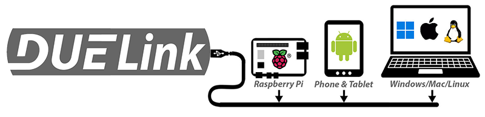

# Supported Systems

---

DUELink modules work with several systems, from [Raspberry Pi](./raspberry-pi) and [Arduino](./arduino) to [Phones and Tablets](phone-tablet), or [PC's & Laptops](./pc-laptop.mdx). These systems work with one or more of the supported [Hosted Languages](../language/intro).

:::tip
By saying host, we mean the system commanding a DUELink [Daisy link](../engine/daisylink) of modules.
:::

Modules can also run [Standalone](../engine/standalone) using the internal [Scripting](../engine/scripting) engine.
