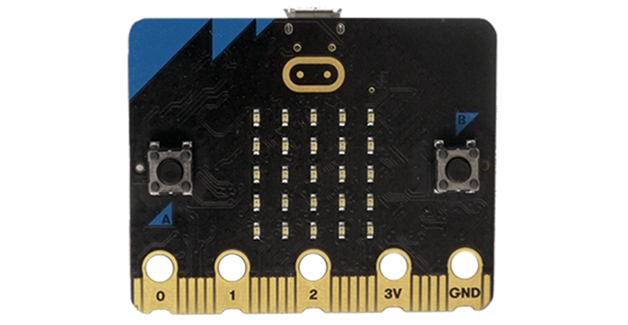
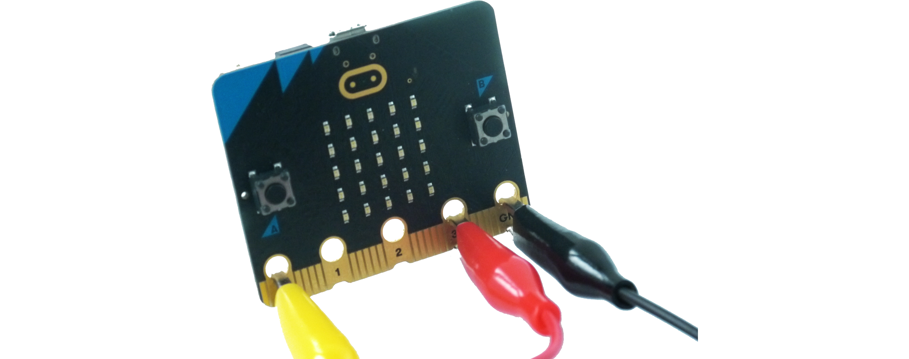
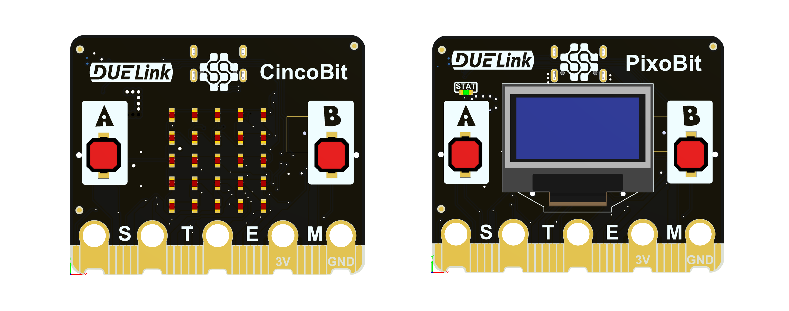
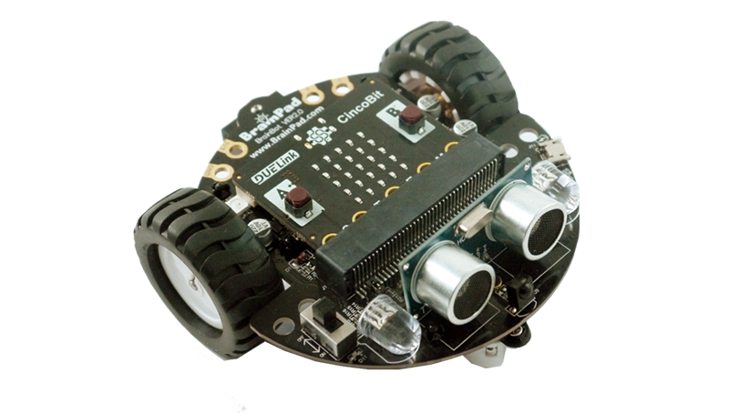
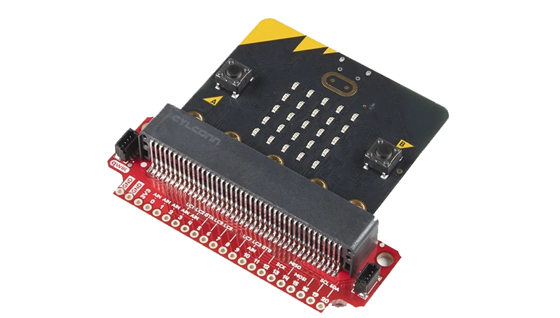

# micro:bit

micro:bit includes edge pads allowing it to plug into accessories. 



Some of those pads have holes, supporting alligator clips.



If you enjoy the edge connector and alligator clips, DUELink offers many bit-compatible boards, such as the ultra-low-cost [CincoBit](../catalog/mainboard/cincobit) and also [PixoBit](../catalog/mainboard/pixobit) that includes a display.



The DUELink [CincoBit](../catalog/mainboard/cincobit) and [PixoBit](../catalog/mainboard/pixobit) work like all other DUELink modules, through DUELink [Scripting Engine](../engine/scripting) or the [Arduino](arduino) IDE, among other [Hosted Language](../language/intro) options. These mainboards can be used with micro:bit accessories, like in this robot!



:::info
DUELink does not currently have a block-coding option but we are still working on it with some important partners, so stay tuned!
:::

If using the official BBC micro:bit, you can use an accessory with JST connector such as [Sparkfun Qwiic micro:bit Breakout](https://www.sparkfun.com/sparkfun-qwiic-micro-bit-breakout.html)



You can use one of two JST sockets as a [Downstream](../interface/downstream) with hundreds of DUELink module options.

Image

Microsoft [MakeCode](https://makecode.microbit.org/) can be used to access the DUELink bus through [I2C](../interface/i2c).

This example blinks the status LED 10 times on any downstream module

```
// you need this to make the example
function stringToBuffer(str: string): Buffer {
    return Buffer.fromUTF8(str);
}
```

[MicroPython](../language/micropython) is another option.

```python
I2c.write(“LED(20,20,10)”)
```
