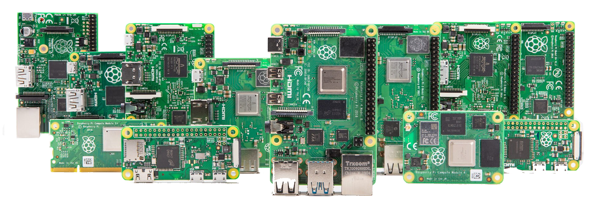
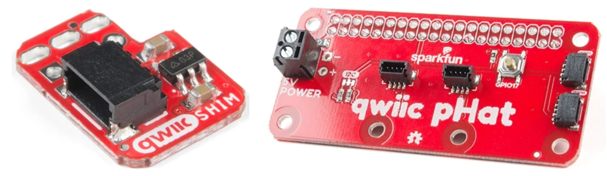
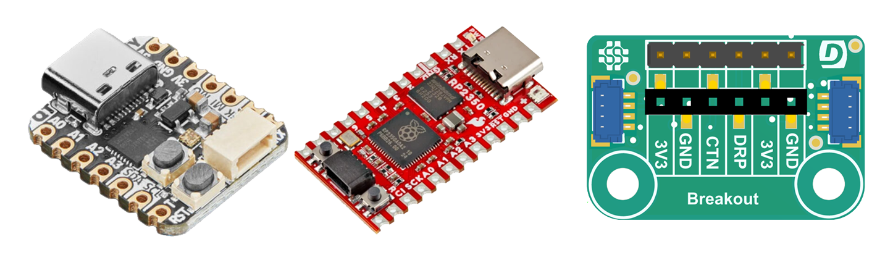

import Tabs from '@theme/Tabs';
import TabItem from '@theme/TabItem';


# Raspberry Pi

There are multiple ways to take advantage of the DUELink ecosystem with the entire Raspberry Pi product line. 



## RPI and RPI Zero

We recommend using [DuePi](../catalog/accessory/duepi.mdx) Hat. The hat uses [UART](../interface/uart) and works with both full-size Raspberry Pi and Raspberry Pi Zero. It includes a display, buzzer, terminal block for wiring, and a [Downstream](../interface/downstream) socket to extend your RPI with hundreds of sensors and actuators.

Everything is accessible through any of the RPI supported [Hosted Languages](../language/intro), such as  [Python](../language/python) .

```python
# Show IP address on display
print("Bye DUE!")
# Beep once a second
```

Here is an example that reads temperature from a temp sensor (image)

```python
# Read Temp from sensor on downstream

# Show on built-in display

```

You can also use breakout boards that bring the RPI’s [I2C](../interface/i2c) bus to a standard JST socket, like the [Sparkfun Qwiic Shim for Raspberry Pi](https://www.sparkfun.com/sparkfun-qwiic-shim-for-raspberry-pi.html) or [Sparkfun Qwiic pHat](https://www.sparkfun.com/sparkfun-qwiic-phat-v2-0-for-raspberry-pi.html).




:::tip 
When using the Qwiic pHat, only use one socket as [Downstream](../interface/downstream). You can use the other sockets to connect other, non-DUELink things.
:::

Same code as before but we are now using the I2C bus.

```python
# Read Temp

# Print to Console
```

## RPI Pico and RP2350/RP2040

Using any of the microcontroller-level boards is possible. We recommend using a board with JST connector, like [Adafruit QT Py RP2040](https://www.adafruit.com/product/4900) or [Sparkfun Pro Micro RP2350](https://www.sparkfun.com/sparkfun-pro-micro-rp2350.html) but you can use the [Breakout](../catalog/accessory/breakout) to wire any Raspberry Pi Pico.



:::tip
Pay attention to how much power these little circuits can provide vs what DUELink modules that are plugged in. Consider [Power Inject](../catalog/accessory/power-inject) to add more juice!
:::

[MicroPython](../language/micropython) is one of the supported options. Here we are showing the light level on a display.


```python
# Read light

# Show on display

```


